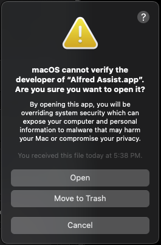
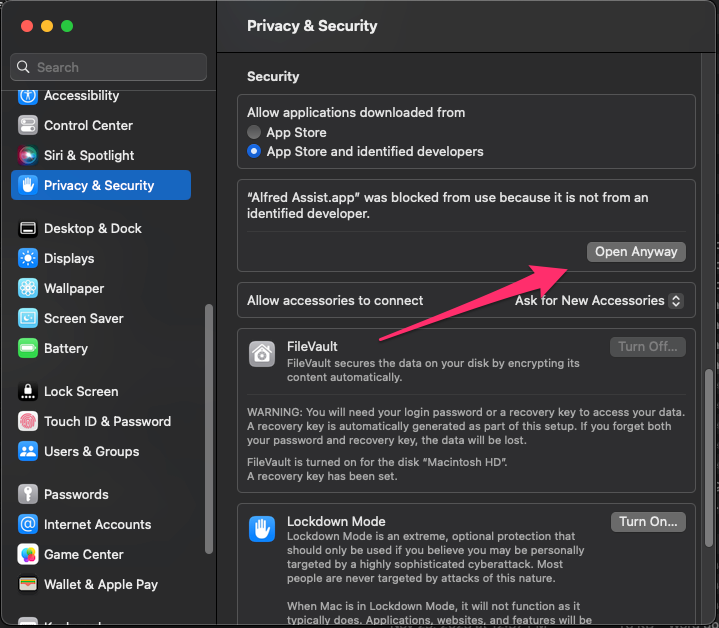
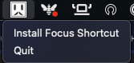
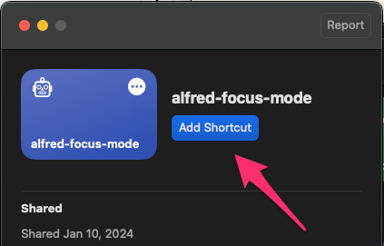
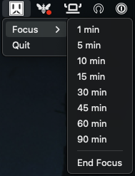

# Alfred Assist

Alfred is a tool that enables you to focus better on your daily work. This project is still a work in progress, there is currently only the `Focus` feature. More features are coming soon, for example, updating your communications apps such as Slack with a DND status and a Pomodoro mode. If you have an idea for a feature, open an issue with the request.

Download Install DMG - [HERE](https://alfred-assist.s3.amazonaws.com/Alfred-Assist_v1.0.0.dmg)

## Focus

The `Focus` feature provides a way for you to enable the Mac Do Not Disturb mode. The standard DND only allows you to specify a DND of 1 hour, until the next morning, or indefinitely. `Focus` allows you to provide a more granular time limit. Not only does it enable DND, it will also hide your App Dock to help you focus on your work and not be distracted by any email or slack notifications that occur during your focus time.

A bonus that is built in to DND is that it will sync across your other Mac devices, like your iPhone and iPad. Also, wanted to give [arodik](https://github.com/arodik) thanks for the inpiration. I had to refactor the hide operations when Ventura rolled out.

## Installation

You can install Alfred Assist with the OSX dmg that can be downloaded from [HERE](https://alfred-assist.s3.amazonaws.com/Alfred-Assist_v1.0.0.dmg). Alfred Assist is currently a pet project and as such you will get an error stating "Alfred Assist can't be opened ...". You will have to permit the app from Mac Settings -> Privacy & Security.

  
  

### Focus Setup

`Focus` works by using a custom Mac Shortcuts, you will not be able to use Focus until you have installed the shortcut. Here are the steps for setup: 

**1. Activate Focus Shortcut:**

- Upon successful installation, an Alfred Assist icon will appear in your menu bar.
- Click on the Alfred Assist icon.
- In the menu, select "Install Focus Shortcut."

  

**2. Shortcut Installation:**

- A window will appear, prompting you to install the shortcut.
- Click the "Add Shortcut" button to complete the installation.

  

**3. Restart Alfred Assist:**

- Focus will be inactive until the shortcut is installed.
- Quit Alfred Assist and relaunch the app.

**4. Access Focus Options:**

- After relaunching, you can now find and use the Focus options within the app.

  

